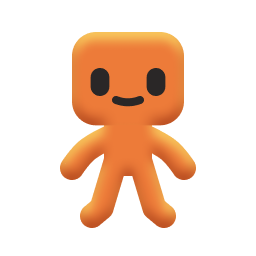
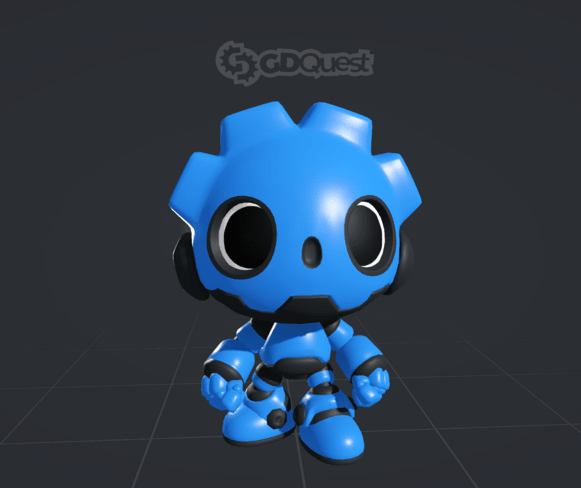
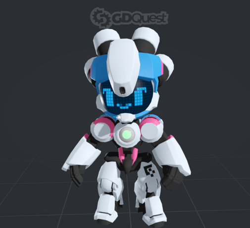
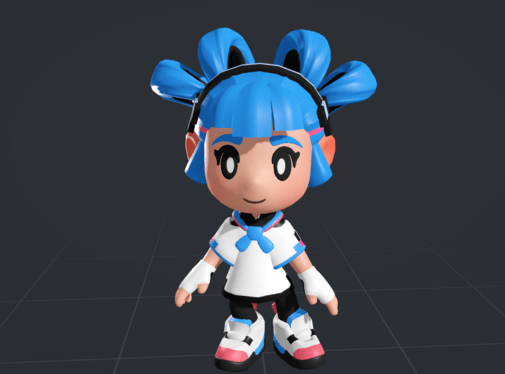

<h1 align="center">

 
3D Characters Repository</h1>

This repository contains our open-source 3D models, pre-configured and compatible with Godot game engine version 4. The models have been tested and are ready to be used out of the box.

# Installation
1. Download or clone this repository.
2. Drag and drop the desired folder(s) from the `models` directory into your project.
3. After Godot imports the character, you can now use it in your project
4. To use the model, you need to instantiate the `model_name_skin.tscn` scene. This is the default scene where the model is set up and where you can call specific methods.

# Models

## Godot robot

- `idle()`: Sets the model to a neutral, action-free state.
- `move()`: Animates the model to simulate walking or forward movement.
- `fall()`: Puts the model into a downward animation, imitating a fall.
- `jump()`: Transitions the model to an upward-leaping animation, simulating a jump.
- `victory_sign()`: Makes a victory sign.

## GDbot

**Properties**

- `_walk_run_blend_position`: This property represents the blending between the walking and running animations of the model. It can be set to different values (e.g. 0.0 to 1.0) to adjust the balance between the two animations, resulting in the model appearing to walk or run depending on the value.

****Methods****

- `idle()`: Sets the model to a neutral, action-free state.
- `walk()`: Animates the model to simulate walking or forward movement.
- `jump()`: Transitions the model to an upward-leaping animation, simulating a jump.
- `fall()`: Puts the model into a downward animation, imitating a fall.
- `set_face()`: Changes the model's facial expression based on input string values like "default", "happy", "dizzy", "sleepy". Corresponding animations include default blinking, a joyful expression, spiraling eyes, or a drowsy countenance.

Note: You can add new expressions by editing `gdbot_face.tscn`. It's a 2D scene that is picked up by a viewport node and displayed on Gdbot's face.

## Sophia

**Properties**

- `_walk_run_blend_position:` Defines the blend between walking and running animations for the model. Values between 0.0 and 1.0 control the transition between these animations.
- `_current_eyes`: Controls Sophia's current eye texture. It can change the eye texture by offsetting the UV position of the material applied to the eyes. Assign a string value between "default", "happy", "surprised", "frowning", "disgust".

**Methods**

- `idle()`: Transitions the model to a neutral, action-free state.
- `walk()`: Simulates walking or forward movement in the model.
- `jump()`: Animates the model as if jumping or leaping upwards.
- `fall()`: Animates the model falling.
- `wall_slide()`: Makes the model slide down a wall.
- `edge_grab()`: Makes the model grab onto the edge of a platform or surface.

## Bee bot

**Methods**

- `idle()`: Puts the model in a neutral, non-action state.
- `attack()`: Simulates an attacking or combat stance in the model.
- `power_off()`: Animates the model shutting down or turning off.

## Beetle bot

**Methods**

- `idle()`: Transitions the model to a neutral, idle state.
- `walk()`: Animates the model as if walking or moving forward.
- `attack()`: Represents the model in an attacking or combat mode.
- `power_off()`: Animates the model shutting down or turning off.
