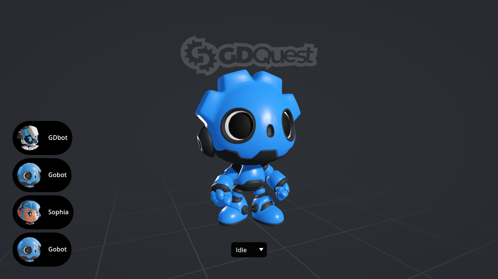
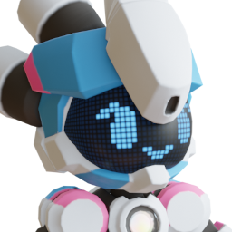

<h1 align="center">

 
3D Characters Repository</h1>

This repository contains our open-source 3D models, pre-configured and compatible with Godot game engine version 4. The models have been tested and are ready to be used out of the box.

# Installation
1. Download or clone this repository.
2. Drag and drop the desired folder(s) from the [`./addons`](./src/addons/) directory into your project, in the `addons` folder.
3. After Godot imports the character, you can now use it in your project
4. To use the model, you need to instantiate the `<model_name>_skin.tscn` scene. This is the default scene where the model is set up and where you can call specific methods.

# Models
<table>
	<tr align="center">
		<th>
		
		</th>
		<th>
		
		</th>
		<th>
		
		</th>
	</tr>
	<tr align="center">
		<th>GDBot</th>
		<th>Sophia</th>
		<th>Gobot</th>
	</tr>
	<tr align="center">
		<th>
		
		</th>
		<th>
		
		</th>
		<th>
		
		</th>
	</tr>
	<tr align="center">
		<th>Round Bat</th>
		<th>Bee Bot</th>
		<th>Beetle Bot</th>
	</tr>
</table>

